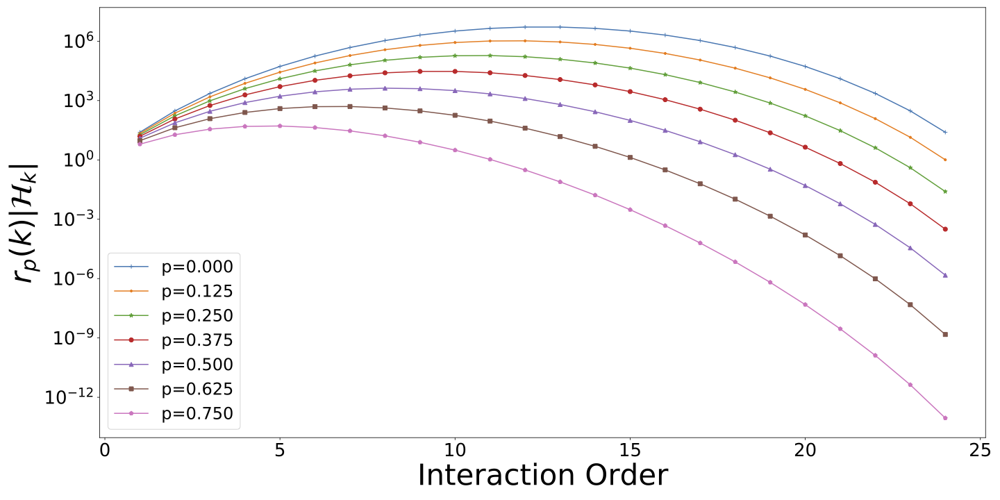

# Dropout as a Regularizer of Interaction Effects

We know Dropout works well, but *how* does it work? In [our paper](https://arxiv.org/abs/2007.00823), we propose a simple view of Dropout: Dropout regularizes against high-order interaction effects.

This can be seen intuitively by the symmetry between the hypothesis space of interaction effects and Dropout regularization:
Given  variables, there are  possible sets of  variables ( univariate effects,  pairwise interactions,  3-way interactions); a -order interaction effect survives Dropout at rate  with probability . These rates effectively cancel:



If you use the ideas in this paper, please cite:

```
@InProceedings{LengerichDropout2022,
  title={Dropout as a Regularizer of Interaction Effects},
  author={Lengerich, Benjamin and Xing, Eric P. and Caruana, Rich},
  journal={{Proceedings of the Twenty Fifth International Conference on Artificial Intelligence and Statistics}},
  year={2022},
  url_Paper = {https://arxiv.org/abs/2007.00823},
  abstract = {We examine Dropout through the perspective of interactions: effects that require multiple variables. Given $N$ variables, there are ${N \choose k}$ possible sets of $k$ variables ($N$ univariate effects, $\mathcal{O}(N^2)$ pairwise interactions, $\mathcal{O}(N^3)$ 3-way interactions); we can thus imagine that models with large representational capacity could be dominated by high-order interactions. In this paper, we show that Dropout contributes a regularization effect which helps neural networks (NNs) explore functions of lower-order interactions before considering functions of higher-order interactions. Dropout imposes this regularization by reducing the effective learning rate of higher-order interactions. As a result, Dropout encourages models to learn lower-order functions of additive components.
This understanding of Dropout has implications for choosing Dropout rates: higher Dropout rates should be used when we need stronger regularization against interactions.
This perspective also issues caution against using Dropout to measure term salience because Dropout regularizes against high-order interactions.
Finally, this view of Dropout as a regularizer of interactions provides insight into the varying effectiveness of Dropout across architectures and datasets.
We also compare Dropout to weight decay and early stopping and find that it is difficult to obtain the same regularization with these alternatives.}
}
```
